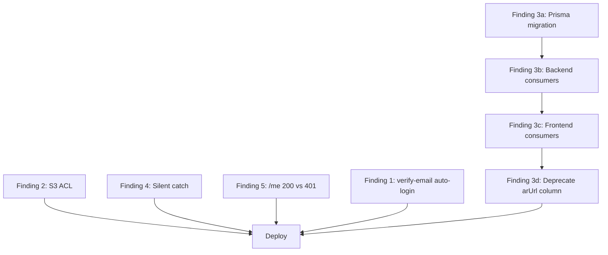
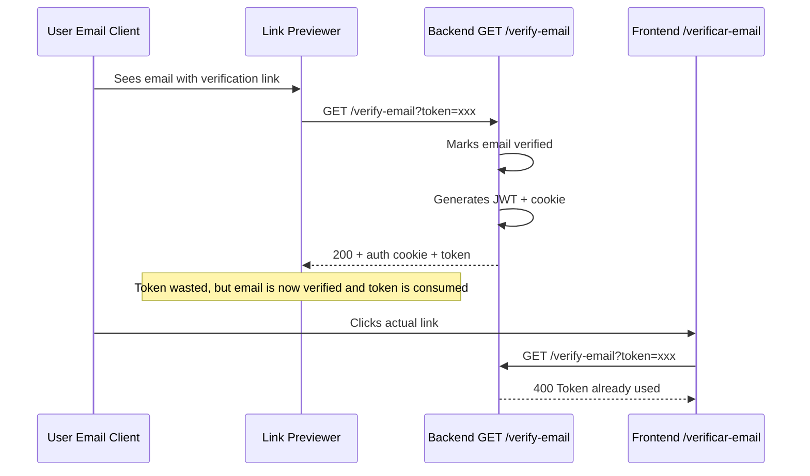
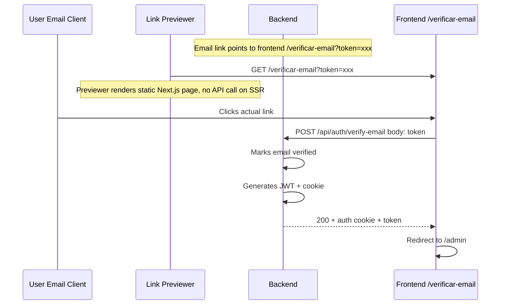
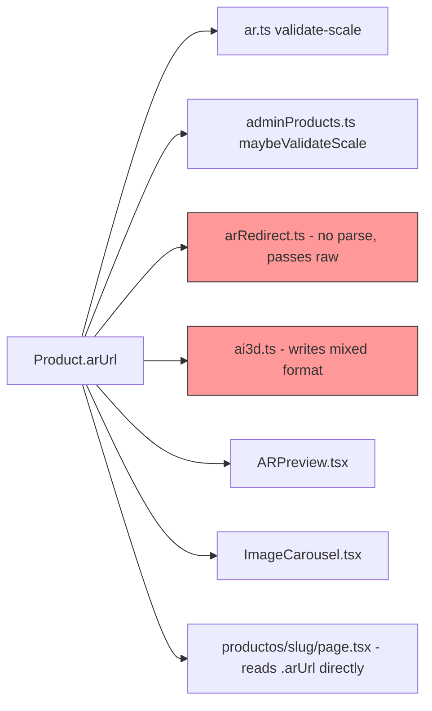

# Review Fix Plan — 5 Coordinated Findings

## Table of Contents

1. [Implementation Order](#implementation-order)
2. [Finding 2 — S3 uploads lack ACL](#finding-2--s3-uploads-lack-acl)
3. [Finding 4 — Silent catch in bootstrap transaction](#finding-4--silent-catch-in-bootstrap-transaction)
4. [Finding 5 — /me returns 200 instead of 401](#finding-5--me-returns-200-instead-of-401)
5. [Finding 1 — GET /verify-email auto-login](#finding-1--get-verify-email-auto-login)
6. [Finding 3 — arUrl stores mixed format](#finding-3--arurl-stores-mixed-format)
7. [Risks & Edge Cases](#risks--edge-cases)

---

## Implementation Status (as of 2026-03-06)

> **⚠️ IMPORTANT:** Most findings have already been implemented! This section tracks current status.

| Finding | Status | Backend | Frontend | Notes |
|---------|--------|---------|----------|-------|
| **F1** verify-email GET | ✅ DONE | [`auth.ts:299-300`](backend/src/routes/auth.ts:299) redirects to frontend, no auth tokens | [`verificar-email/page.tsx:32`](mueblesar-web/app/verificar-email/page.tsx:32) uses window.location.href | GET now redirects instead of returning tokens |
| **F2** S3 ACL | ✅ DONE | [`s3.ts:41,75`](backend/src/lib/s3.ts:41) `ACL: "public-read"` | N/A | Both upload functions updated |
| **F3** arUrl mixed format | 🔄 PARTIAL | Schema + migration + partial | **NOT DONE** | See detailed status below |
| **F4** Silent catch | ✅ DONE | [`auth.ts:169-173`](backend/src/routes/auth.ts:169) checks P2002 | N/A | Only swallows unique constraint violations |
| **F5** /me 200→401 | ✅ DONE | [`auth.ts:130`](backend/src/routes/auth.ts:130) returns 401 | Works (needs optional defensive check) | Backend returns 401, frontend handles it |

### Finding 3 (arUrl) Detailed Status

#### ✅ Completed

| Component | File | Status |
|-----------|------|--------|
| Prisma Schema | [`schema.prisma:84-85`](backend/prisma/schema.prisma:84) | `glbUrl` and `usdzUrl` columns added |
| Migration SQL | [`20260306190000_add_glb_usdz_urls/migration.sql`](backend/prisma/migrations/20260306190000_add_glb_usdz_urls/migration.sql) | Created but NOT APPLIED yet |
| Backend: ai3d.ts | [`ai3d.ts:267-268`](backend/src/routes/ai3d.ts:267) | Writes to both `glbUrl` and `usdzUrl` |
| Backend: arRedirect.ts | [`arRedirect.ts:17,20,24-25,30,32`](backend/src/routes/arRedirect.ts:17) | Reads from new columns with arUrl fallback |
| Backend: adminProducts.ts | [`adminProducts.ts:29-30,102-105`](backend/src/routes/adminProducts.ts:29) | Accepts new fields in schema |

#### 🔄 Pending (Frontend)

| File | Current State | Required Change |
|------|---------------|----------------|
| [`api.ts:32`](mueblesar-web/app/lib/api.ts:32) | Has `arUrl?: string` | Add `glbUrl?: string; usdzUrl?: string` |
| [`admin.types.ts:11,75,97`](mueblesar-web/app/lib/admin.types.ts:11) | Has `arUrl` in types | Add `glbUrl`, `usdzUrl` |
| [`inventory/page.tsx`](mueblesar-web/app/admin/inventory/page.tsx) | Form uses `arUrl` field | Use `glbUrl`/`usdzUrl` in form |
| [`AI3DGenerator.tsx:11,81`](mueblesar-web/app/components/admin/AI3DGenerator.tsx:11) | `onSuccess` returns JSON string | Update to pass `glbUrl`/`usdzUrl` separately |
| [`ARPreview.tsx:15,60-115`](mueblesar-web/app/components/products/ARPreview.tsx:15) | Accepts `arUrl`, parses JSON | Accept `glbUrl`/`usdzUrl` directly |
| [`ImageCarousel.tsx:17,39-71`](mueblesar-web/app/components/media/ImageCarousel.tsx:17) | Same as ARPreview | Same refactor |

#### ⚠️ Migration Not Applied

The migration file exists but has NOT been applied to the database. To apply:

```bash
cd backend
npx prisma migrate deploy
# OR for development:
npx prisma db push
```

---

## Implementation Order



**Recommended order:**

| Phase | Finding | Rationale |
|-------|---------|-----------|
| 1 | **Finding 2** — S3 ACL | One-line fix, zero dependencies, unblocks 403 errors on uploaded models |
| 2 | **Finding 4** — Silent catch | One-line fix, zero dependencies, prevents masked bootstrap errors |
| 3 | **Finding 5** — /me endpoint | Low-risk backend+frontend coordination, 2 frontend callers only |
| 4 | **Finding 1** — verify-email | Backend+frontend change, CRITICAL security fix |
| 5 | **Finding 3** — arUrl migration | Largest change: schema migration + 15+ files across both codebases |

Findings 1-4 can be done in any order since they are independent. Finding 3 is the largest and most risky, so it goes last.

---

## Finding 2 — S3 uploads lack ACL

### Problem

[`uploadGLBToS3()`](backend/src/lib/s3.ts:21) and [`uploadUSDZToS3()`](backend/src/lib/s3.ts:54) construct public URLs like `https://bucket.s3.region.amazonaws.com/key` but the `PutObjectCommand` never sets `ACL: 'public-read'`. Without this, S3 returns 403 Forbidden for any anonymous GET request.

### Files to modify

| File | Change |
|------|--------|
| [`backend/src/lib/s3.ts`](backend/src/lib/s3.ts:36) | Add `ACL: 'public-read'` to GLB `PutObjectCommand` (line 36-41) |
| [`backend/src/lib/s3.ts`](backend/src/lib/s3.ts:69) | Add `ACL: 'public-read'` to USDZ `PutObjectCommand` (line 69-74) |

### Exact change

In both `PutObjectCommand` constructors, add `ACL: 'public-read'`:

```typescript
const command = new PutObjectCommand({
  Bucket: bucketName,
  Key: finalKey,
  Body: buffer,
  ContentType: contentType,
  ACL: 'public-read',          // <-- ADD THIS
});
```

### Prerequisites

- The S3 bucket must have **Object Ownership** set to `BucketOwnerPreferred` or `ObjectWriter` (not `BucketOwnerEnforced`), otherwise the SDK will reject the ACL parameter.
- Verify via AWS Console → S3 → Bucket → Permissions → Object Ownership.
- If the bucket uses `BucketOwnerEnforced`, an alternative is to add a **bucket policy** granting `s3:GetObject` to `*` for the relevant prefix instead.

---

## Finding 4 — Silent catch in bootstrap transaction

### Problem

In [`backend/src/routes/auth.ts`](backend/src/routes/auth.ts:169) line 169, the `catch {}` block swallows ALL errors from the `prisma.$transaction()` call during first-user bootstrap. This means database connection errors, permission errors, or schema issues are silently ignored, and the code falls through to the "require admin auth" path — which then returns a misleading 403.

### Files to modify

| File | Change |
|------|--------|
| [`backend/src/routes/auth.ts`](backend/src/routes/auth.ts:169) | Replace empty `catch {}` with Prisma P2002 check |

### Exact change

```typescript
// BEFORE (line 169)
} catch {
  // Transaction failed (e.g. concurrent bootstrap) — fall through to admin auth check
}

// AFTER
} catch (err: unknown) {
  // Only swallow unique constraint violations (concurrent bootstrap race)
  const isPrismaUniqueViolation =
    err instanceof Error &&
    'code' in err &&
    (err as any).code === 'P2002';
  if (!isPrismaUniqueViolation) {
    console.error('Bootstrap transaction failed:', err);
    return res.status(500).json({ error: 'Internal server error during registration' });
  }
  // P2002 = concurrent bootstrap, fall through to admin auth check
}
```

---

## Finding 5 — /me returns 200 {user:null} instead of 401

### Problem

[`GET /me`](backend/src/routes/auth.ts:127) at line 127 uses a soft check (`authenticateRequest`) and returns `{ user: null }` with status 200 when the cookie/token is missing or invalid. This is by design to allow frontend soft-checks, but it deviates from REST conventions and makes it harder for middleware/interceptors to detect unauthenticated state.

### Analysis of frontend consumers

| File | Line | How it handles the response |
|------|------|-----------------------------|
| [`mueblesar-web/app/login/page.tsx`](mueblesar-web/app/login/page.tsx:23) | 23-28 | Calls `/me`, checks `data.user`, redirects if truthy. **Does NOT check `res.ok`**. Works with current 200+null. |
| [`mueblesar-web/app/admin/layout.tsx`](mueblesar-web/app/admin/layout.tsx:55) | 55-60 | Calls `/me`, checks `res.ok` first, then checks `data.user`. **Already handles non-200 via `if (!res.ok)`**. Works with either approach. |

### Recommended approach: Keep 200 but add explicit `authenticated: false` field

Changing to 401 would break [`login/page.tsx`](mueblesar-web/app/login/page.tsx:23) which does not check `res.ok` before calling `res.json()`. The safest fix is:

### Files to modify

| File | Change |
|------|--------|
| [`backend/src/routes/auth.ts`](backend/src/routes/auth.ts:127) | Update `/me` response to include `authenticated` boolean |
| [`mueblesar-web/app/login/page.tsx`](mueblesar-web/app/login/page.tsx:23) | Update to check `res.ok` defensively |
| [`mueblesar-web/app/admin/layout.tsx`](mueblesar-web/app/admin/layout.tsx:55) | No change needed — already handles `!res.ok` |

### Backend change

```typescript
// backend/src/routes/auth.ts line 127
router.get("/me", async (req, res) => {
  const user = await authenticateRequest(req);
  if (!user) {
    return res.status(401).json({ user: null, authenticated: false });
  }
  return res.json({ user: publicUser(user), authenticated: true });
});
```

### Frontend change — login/page.tsx

```typescript
// mueblesar-web/app/login/page.tsx line 22-29
const check = async () => {
  try {
    const res = await fetch(`${API_BASE}/api/auth/me`, { credentials: "include" });
    if (!res.ok) { setCheckingAuth(false); return; }  // <-- ADD THIS
    const data = await res.json();
    if (data.user) {
      router.push("/admin");
      return;
    }
  } catch { }
  setCheckingAuth(false);
};
```

---

## Finding 1 — GET /verify-email auto-login

### Problem

[`GET /verify-email`](backend/src/routes/auth.ts:266) at line 266 marks the email as verified AND issues a JWT token + auth cookie. Email link previewers (Slack, WhatsApp, iOS Mail, Outlook) follow GET links automatically, which would silently authenticate the account in the previewer's ephemeral browser session. While the token is wasted in the previewer, the email gets marked as verified without user intent, and the verification token gets consumed.

More critically: if the verification URL is opened in a shared/public context, the auth cookie grants full access.

### Current flow



### Proposed flow



### Key design decision

The verification link in emails already points to the **frontend** (`${SITE_URL}/verificar-email?token=xxx`), as seen in [`createAndSendVerificationToken()`](backend/src/routes/auth.ts:88) line 88. The frontend page at [`mueblesar-web/app/verificar-email/page.tsx`](mueblesar-web/app/verificar-email/page.tsx:30) then calls the backend `GET /api/auth/verify-email?token=xxx`.

The fix is:
1. **Change backend** `GET /verify-email` to `POST /verify-email` (token in body, not query string)
2. **Update frontend** to use POST instead of GET
3. **Optionally** keep GET endpoint but only for verification without auth (redirect to frontend)

### Files to modify

| File | Change |
|------|--------|
| [`backend/src/routes/auth.ts`](backend/src/routes/auth.ts:266) | Change GET to POST; move token from query to body; keep auth cookie on POST |
| [`mueblesar-web/app/verificar-email/page.tsx`](mueblesar-web/app/verificar-email/page.tsx:30) | Change fetch from GET to POST with token in body |

### Backend change

```typescript
// Replace GET /verify-email (line 266) with POST
router.post("/verify-email", async (req, res) => {
  const { token } = req.body;
  if (!token || typeof token !== "string") {
    return res.status(400).json({ error: "Token requerido" });
  }

  // ... rest of verification logic stays the same (lines 272-313)
  // Including: mark verified, delete tokens, send welcome email, sign JWT, set cookie
});

// Optional: keep GET as a safe redirect-only endpoint (no auth, no token consumption)
router.get("/verify-email", async (req, res) => {
  const { token } = req.query;
  if (!token || typeof token !== "string") {
    return res.status(400).json({ error: "Token requerido" });
  }
  // Just redirect to the frontend page — let the frontend POST
  const siteUrl = env.SITE_URL || "http://localhost:3000";
  return res.redirect(`${siteUrl}/verificar-email?token=${token}`);
});
```

### Frontend change

```typescript
// mueblesar-web/app/verificar-email/page.tsx line 29-31
const res = await fetch(`${API_BASE}/api/auth/verify-email`, {
  method: "POST",
  headers: { "Content-Type": "application/json" },
  credentials: "include",
  body: JSON.stringify({ token }),
});
```

---

## Finding 3 — arUrl stores mixed format

### Problem

The [`Product.arUrl`](backend/prisma/schema.prisma:83) field (line 83 of schema) is `String?` and stores **two different formats**:

1. **Plain URL string** — when only GLB exists (e.g., `"https://bucket.s3.amazonaws.com/model.glb"`)
2. **JSON string** — when both GLB and USDZ exist (e.g., `'{"glb":"https://...glb","usdz":"https://...usdz"}'`)

This forces every consumer to defensively `try { JSON.parse() } catch {}` to detect the format. This pattern is currently duplicated in **7 locations** across the codebase.

### Current duplicated JSON.parse pattern



### Comprehensive file inventory for arUrl

#### Backend files that READ arUrl

| File | Line(s) | How it uses arUrl |
|------|---------|-------------------|
| [`backend/src/routes/ar.ts`](backend/src/routes/ar.ts:60) | 60-66 | `JSON.parse()` to extract `.glb` for scale validation |
| [`backend/src/routes/adminProducts.ts`](backend/src/routes/adminProducts.ts:123) | 123-129 | `JSON.parse()` to extract `.glb` for scale validation |
| [`backend/src/routes/arRedirect.ts`](backend/src/routes/arRedirect.ts:26) | 17-31 | Reads `product.arUrl` raw, passes to redirect as `?glb=`. **BUG: does not parse JSON**, would pass `{"glb":"...","usdz":"..."}` as the glb param |
| [`backend/src/routes/products.ts`](backend/src/routes/products.ts:63) | 63, 114 | Only checks `arUrl: { not: null }` for filtering; does not read value |
| [`backend/scripts/check-ar-url.ts`](backend/scripts/check-ar-url.ts:8) | 7-9 | Diagnostic script, reads arUrl for inspection |

#### Backend files that WRITE arUrl

| File | Line(s) | What it writes |
|------|---------|----------------|
| [`backend/src/routes/ai3d.ts`](backend/src/routes/ai3d.ts:263) | 263-269 | Writes `JSON.stringify({glb, usdz})` if USDZ exists, else plain GLB URL |
| [`backend/src/routes/adminProducts.ts`](backend/src/routes/adminProducts.ts:45) | 45 | Accepts arUrl from frontend form — validated by `dualUrlSchema` (accepts both formats) |
| [`backend/prisma/seed.ts`](backend/prisma/seed.ts:61) | 61, 80 | Seeds with plain URL string |
| [`backend/src/data/mock.ts`](backend/src/data/mock.ts:72) | 72 | Mock data with plain URL string |
| [`backend/src/scripts/importMockProducts.js`](backend/src/scripts/importMockProducts.js:70) | 70 | Import script with plain URL string |

#### Frontend files that READ arUrl

| File | Line(s) | How it uses arUrl |
|------|---------|-------------------|
| [`mueblesar-web/app/components/products/ARPreview.tsx`](mueblesar-web/app/components/products/ARPreview.tsx:60) | 60-115 | `JSON.parse()` to extract `.glb` and `.usdz` |
| [`mueblesar-web/app/components/media/ImageCarousel.tsx`](mueblesar-web/app/components/media/ImageCarousel.tsx:39) | 39-71 | `JSON.parse()` to extract `.glb` and `.usdz` |
| [`mueblesar-web/app/components/media/ColorImageCarousel.tsx`](mueblesar-web/app/components/media/ColorImageCarousel.tsx:16) | 16-67 | Passes arUrl through to `ImageCarousel` |
| [`mueblesar-web/app/productos/[slug]/page.tsx`](mueblesar-web/app/productos/[slug]/page.tsx:41) | 41-92 | Reads `product.arUrl` directly; passes to `ImageCarousel` and checks for `.usdz` extension |
| [`mueblesar-web/app/productos/page.tsx`](mueblesar-web/app/productos/page.tsx:73) | 73 | Sort by `Boolean(b.arUrl)` — existence check only |
| [`mueblesar-web/app/components/products/MarketplaceProductCard.tsx`](mueblesar-web/app/components/products/MarketplaceProductCard.tsx:19) | 19 | `Boolean(product.arUrl)` — existence check only |
| [`mueblesar-web/app/components/products/ProductCard.tsx`](mueblesar-web/app/components/products/ProductCard.tsx:60) | 60 | `product.arUrl &&` — existence check only |
| [`mueblesar-web/app/components/products/PDPCTA.tsx`](mueblesar-web/app/components/products/PDPCTA.tsx:92) | 92 | Passes `arUrl` to `ARPreview` |
| [`mueblesar-web/app/admin/inventory/page.tsx`](mueblesar-web/app/admin/inventory/page.tsx:179) | 179-741 | Multiple uses: form field, validation, CSV export, AR badge display |
| [`mueblesar-web/app/ar/page.tsx`](mueblesar-web/app/ar/page.tsx:18) | 18-19 | Receives `glb` and `usdz` as separate query params (already decomposed) |

#### Frontend type definitions

| File | Line(s) | Field |
|------|---------|-------|
| [`mueblesar-web/app/lib/api.ts`](mueblesar-web/app/lib/api.ts:32) | 32 | `arUrl?: string` in Product type |
| [`mueblesar-web/app/lib/admin.types.ts`](mueblesar-web/app/lib/admin.types.ts:11) | 11, 75, 97 | `arUrl` in Product, ProductForm types |

### Migration strategy

#### Phase 3a: Prisma schema migration

Add two new columns alongside the existing `arUrl`:

```prisma
model Product {
  // ... existing fields ...
  arUrl       String?    // DEPRECATED — kept for backward compat during migration
  glbUrl      String?    // New: dedicated GLB URL
  usdzUrl     String?    // New: dedicated USDZ URL
  // ...
}
```

#### Migration SQL

```sql
-- Migration: add_separate_ar_urls
ALTER TABLE "Product" ADD COLUMN "glbUrl" TEXT;
ALTER TABLE "Product" ADD COLUMN "usdzUrl" TEXT;

-- Data migration: populate new columns from existing arUrl
-- Case 1: arUrl is a JSON string with {glb, usdz}
UPDATE "Product"
SET
  "glbUrl" = ("arUrl"::jsonb)->>'glb',
  "usdzUrl" = ("arUrl"::jsonb)->>'usdz'
WHERE "arUrl" IS NOT NULL
  AND "arUrl" LIKE '{%'
  AND "arUrl"::jsonb ? 'glb';

-- Case 2: arUrl is a plain URL string (GLB only)
UPDATE "Product"
SET "glbUrl" = "arUrl"
WHERE "arUrl" IS NOT NULL
  AND "arUrl" NOT LIKE '{%';
```

#### Data migration script outline

```typescript
// backend/scripts/migrate-ar-urls.ts
import { prisma } from '../src/lib/prisma.js';

async function main() {
  const products = await prisma.product.findMany({
    where: { arUrl: { not: null } },
    select: { id: true, arUrl: true },
  });

  let migrated = 0;
  let skipped = 0;

  for (const product of products) {
    if (!product.arUrl) { skipped++; continue; }

    let glbUrl: string | null = null;
    let usdzUrl: string | null = null;

    try {
      const parsed = JSON.parse(product.arUrl);
      if (typeof parsed === 'object' && parsed !== null && parsed.glb) {
        glbUrl = parsed.glb;
        usdzUrl = parsed.usdz || null;
      }
    } catch {
      // Plain URL string — treat as GLB
      glbUrl = product.arUrl;
    }

    await prisma.product.update({
      where: { id: product.id },
      data: { glbUrl, usdzUrl },
    });
    migrated++;
  }

  console.log(`Migrated ${migrated} products, skipped ${skipped}`);
}

main().catch(console.error).finally(() => prisma.$disconnect());
```

#### Phase 3b: Update backend consumers

| File | Change |
|------|--------|
| [`backend/src/routes/ai3d.ts`](backend/src/routes/ai3d.ts:263) | Write `glbUrl` and `usdzUrl` separately instead of `arUrl` |
| [`backend/src/routes/adminProducts.ts`](backend/src/routes/adminProducts.ts:45) | Accept `glbUrl`/`usdzUrl` in schema; remove `dualUrlSchema`; update `maybeValidateScale` to use `glbUrl` directly |
| [`backend/src/routes/ar.ts`](backend/src/routes/ar.ts:60) | Remove `JSON.parse()` try/catch; use `glbUrl` directly |
| [`backend/src/routes/arRedirect.ts`](backend/src/routes/arRedirect.ts:17) | Select `glbUrl`/`usdzUrl` instead of `arUrl`; pass `glb` and `usdz` as separate query params |
| [`backend/src/routes/products.ts`](backend/src/routes/products.ts:63) | Change filter from `arUrl: { not: null }` to `glbUrl: { not: null }` |
| [`backend/prisma/seed.ts`](backend/prisma/seed.ts:61) | Change `arUrl` to `glbUrl` in seed data |
| [`backend/src/data/mock.ts`](backend/src/data/mock.ts:72) | Change `arUrl` to `glbUrl` in mock data |
| [`backend/src/scripts/importMockProducts.js`](backend/src/scripts/importMockProducts.js:70) | Change `arUrl` to `glbUrl` in import |
| [`backend/scripts/check-ar-url.ts`](backend/scripts/check-ar-url.ts:8) | Update to check `glbUrl`/`usdzUrl` |

**Backend compatibility layer** — During transition, add a computed `arUrl` to API responses:

```typescript
// In product serialization / response mapping
function serializeProduct(product: Product) {
  return {
    ...product,
    // Backward compat: keep arUrl in API response for older frontend versions
    arUrl: product.glbUrl
      ? (product.usdzUrl
        ? JSON.stringify({ glb: product.glbUrl, usdz: product.usdzUrl })
        : product.glbUrl)
      : null,
  };
}
```

#### Phase 3c: Update frontend consumers

| File | Change |
|------|--------|
| [`mueblesar-web/app/lib/api.ts`](mueblesar-web/app/lib/api.ts:32) | Add `glbUrl?: string; usdzUrl?: string;` to Product type |
| [`mueblesar-web/app/lib/admin.types.ts`](mueblesar-web/app/lib/admin.types.ts:11) | Add `glbUrl`, `usdzUrl` to Product and ProductForm types |
| [`mueblesar-web/app/components/products/ARPreview.tsx`](mueblesar-web/app/components/products/ARPreview.tsx:15) | Change props to accept `glbUrl` and `usdzUrl` separately; remove `JSON.parse()` |
| [`mueblesar-web/app/components/media/ImageCarousel.tsx`](mueblesar-web/app/components/media/ImageCarousel.tsx:17) | Change prop from `arUrl` to `glbUrl`/`usdzUrl`; remove `JSON.parse()` |
| [`mueblesar-web/app/components/media/ColorImageCarousel.tsx`](mueblesar-web/app/components/media/ColorImageCarousel.tsx:16) | Pass `glbUrl`/`usdzUrl` instead of `arUrl` |
| [`mueblesar-web/app/productos/[slug]/page.tsx`](mueblesar-web/app/productos/[slug]/page.tsx:41) | Use `product.glbUrl` / `product.usdzUrl` directly |
| [`mueblesar-web/app/productos/page.tsx`](mueblesar-web/app/productos/page.tsx:73) | Change `arUrl` to `glbUrl` in sort |
| [`mueblesar-web/app/components/products/MarketplaceProductCard.tsx`](mueblesar-web/app/components/products/MarketplaceProductCard.tsx:19) | Change `arUrl` to `glbUrl` for existence check |
| [`mueblesar-web/app/components/products/ProductCard.tsx`](mueblesar-web/app/components/products/ProductCard.tsx:18) | Change `arUrl` to `glbUrl` in type and render |
| [`mueblesar-web/app/components/products/PDPCTA.tsx`](mueblesar-web/app/components/products/PDPCTA.tsx:92) | Pass `glbUrl`/`usdzUrl` to ARPreview |
| [`mueblesar-web/app/admin/inventory/page.tsx`](mueblesar-web/app/admin/inventory/page.tsx:179) | Update form, validation, CSV export, AR badge to use `glbUrl`/`usdzUrl` |
| [`mueblesar-web/app/components/admin/AI3DGenerator.tsx`](mueblesar-web/app/components/admin/AI3DGenerator.tsx) | Update `onSuccess` callback type and `currentArUrl` prop |

#### Phase 3d: Deprecate arUrl column

After all consumers are migrated and deployed:

1. Remove the backward-compat `arUrl` serialization from the API
2. Create a final migration to drop the `arUrl` column:

```sql
-- Migration: drop_deprecated_arurl
ALTER TABLE "Product" DROP COLUMN "arUrl";
```

> **WARNING:** Do NOT drop the column until all clients are confirmed to be on the new schema. Keep `arUrl` populated during Phase 3b for rollback safety.

---

## Risks & Edge Cases

### Finding 1 — verify-email

| Risk | Mitigation |
|------|------------|
| Users with old verification emails still have GET links | Keep GET endpoint as a safe redirect to frontend; frontend will POST |
| Email previewers may execute JavaScript on the frontend page | The frontend page only POSTs on `useEffect` which requires client JS; previewers don't execute JS |
| Token consumed by prefetcher before user clicks | Switching to POST eliminates this since prefetchers only do GET/HEAD |

### Finding 2 — S3 ACL

| Risk | Mitigation |
|------|------------|
| Bucket has `BucketOwnerEnforced` object ownership | Check bucket settings first; use bucket policy as alternative |
| Existing objects remain private | Run a one-time S3 batch operation to update ACL on existing objects, or re-upload |

### Finding 3 — arUrl migration

| Risk | Mitigation |
|------|------------|
| Data loss during migration | New columns are additive; `arUrl` is kept; rollback = just use old column |
| Frontend/backend version mismatch during deploy | Backend compat layer provides `arUrl` in responses during transition |
| [`arRedirect.ts`](backend/src/routes/arRedirect.ts:26) currently has a **bug** — passes raw JSON as `?glb=` param | This bug exists today; the migration fixes it by using `glbUrl` directly |
| Products with `arUrl` that is neither valid JSON nor valid URL | Migration script should log and skip these; add a validation pass first |
| [`productos/[slug]/page.tsx`](mueblesar-web/app/productos/[slug]/page.tsx:50) checks `.arUrl?.toLowerCase().endsWith(".usdz")` | This check is already broken with JSON format; migration to `usdzUrl` fixes it properly |

### Finding 4 — Silent catch

| Risk | Mitigation |
|------|------------|
| Concurrent registration race now returns 500 instead of falling through | Only P2002 (unique constraint) is swallowed; this is the exact concurrent-bootstrap scenario |
| Other Prisma errors that should fall through | No — non-P2002 errors indicate real problems that should surface |

### Finding 5 — /me endpoint

| Risk | Mitigation |
|------|------------|
| Other unknown frontend consumers of `/me` | Searched codebase thoroughly — only 2 callers found, both analyzed |
| Third-party integrations relying on 200 + null | None found; API is internal-only |

---

## Summary: Complete file change matrix

| Finding | Backend Files | Frontend Files | Total |
|---------|--------------|----------------|-------|
| **F1** — verify-email | 1 | 1 | **2** |
| **F2** — S3 ACL | 1 | 0 | **1** |
| **F3** — arUrl migration | 9 + migration + script | 12 | **~23** |
| **F4** — Silent catch | 1 | 0 | **1** |
| **F5** — /me endpoint | 1 | 1 | **2** |
| **Total** | **13+** | **14** | **~29** |
